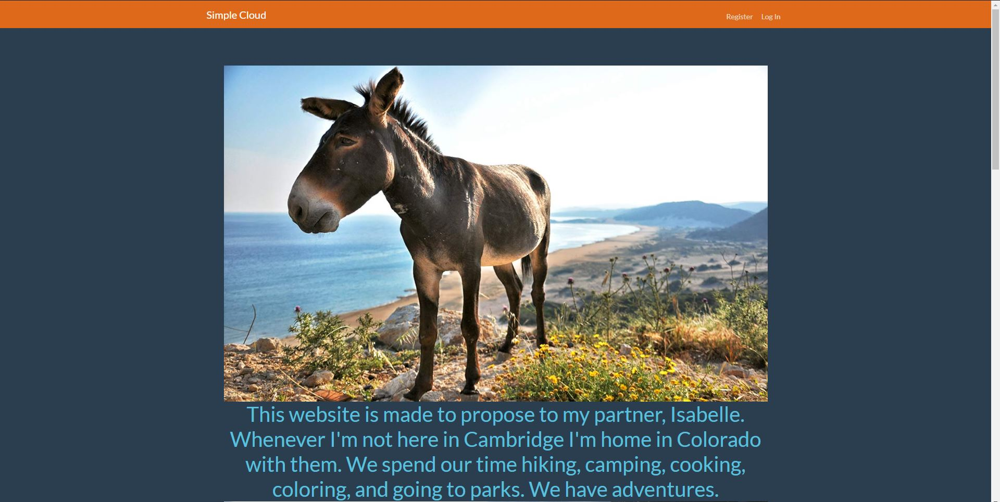

# LIVE YOUR LIFE WITH ME:  A Simple Cloud  

## The Background
I had known my then girlfriend Isabelle for 4 years. We had a child together just after highschool. I knew I wanted to marry her -- but how could I ask? I couldn't ask in some normal way, no. I had to incorporate something she loved about me, to make it a part of us. Being who I am, I also had to solve a problem with my proposal. I like to fix things, and I like to mess with computers, and *she likes these things about me*.  

## The Problem
One night, laying in bed, I was looking at pictures of her and our daughter. She and I both had little flashdrives for our phones to hold all the pictures and videos we had. They were small, but it was cumbersome to carry them around, transfer and organize the photos, and use a separate app for all of it.   
**We needed a way to centralize our photos.**

## The Solution
*The cloud.* I might not be able to make something so complicated as Google [Drive][Drive] or Microsoft's [OneDrive][OneDrive], but a simple cloud program to store our photos somewhere we had more space. So I made a website, and thought if I could host it on my own network (which made sense because if only two people use the site there wouldn't be much traffic) on my own computer with extendable memory, we wouldn't run out of space. A Python program is simple enough, and has a microframework I learned in CS50 called [Flask][Flask] which allows me to make a pleasing website. The Python backend allows me to use any kind of database to organize the photos and write directly to disk to store them.  
I decided to use a JSON database because of it's tree nature, so I could implement new features later on in the website, like organizing by photograph tags, date, and the like. With SQL, this would have required a more time-intensive search as each tag would be added to a single string, instead of leaves of the "tag" branch. I decided on using [MongoDB][Mongo] as my database because it had a simple Python framework and could be hosted locally, or, luckily, through their own service. I couldn't host the website locally to start, so I would have to use a service. I found [PythonAnywhere][PA] to be a greatly valued experience, at only $5 a month I get to host my python app and use my own domain for it, and it allows me 1gb space which would be enough to start. But to host the site for general viewing, I decided on Heroku.  

### The Proposal
The main page of the website for me was the proposal. I designed the home page to be simple but with good color design, displaying photographs my fiance would enjoy. I populated the page with sentences and paragraphs meaningful to us. I filled some pictures into the cloud of our daughter and us to show her the use. Then when the time came, I took her to dinner, and afterwards texted her the link. She opened it and read it, and found me on my knee with a ring extended. She said yes.  

### The Features
There exists a home page, a login page, an upload page, a file browser page, then a file viewer page. There is a banner atop the site, with a drop-down menu to take you to the upload and browse pages, but only if you're logged in. There's a password check but it's not complicated. From the file browse page you may delete files if they're marked so, download files, or view them. You will see in the browse page who uploaded it, its name, and date.

### The Repurpose
I had to repurpose it for viewing. I didn't want the world to see what I gave my fiance, so I changed all the wording and the photos. It's a separate branch in the repository that is hosted on Heroku. Hosting on heroku was initially an issue until I created the right requirements.txt file and the correct Procfile. Once those were just right, hosting was a snap.

## The Results
[Simple Cloud][Simple Cloud]  
See for yourself a running, public version of the simple cloud I created for my fiance.

## The Lessons
This project taught me how to make frameworks work together. The Flask framework and the Mongo framework work together nicely, but Flask and Heroku need some elbow grease and another framework, Gunicorn, to work correctly.  This taught me about git branches and how to implement new features without crashing the whole site. I used the branch feature for the image viewing implementation on the site. I also used it for Heroku deployment.

[Drive]: https://drive.google.com
[OneDrive]: https://onedrive.live.com/about/en-us/
[Flask]: http://flask.pocoo.org/
[Mongo]: https://www.mongodb.com/
[PA]: https://www.pythonanywhere.com
[Simple Cloud]: https://simplecloud.herokuapp.com
